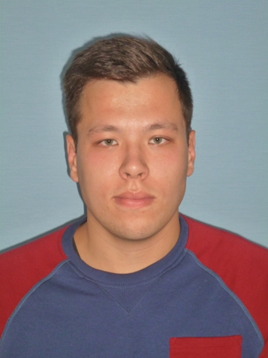

# Software Developer
[](/getemployeephoto.JPG)

## Personal Information

Vadim Dmitriev <br> 
Phone: +60187855012 <br> 
Email: garfield.the.cat.loves.lasagna@gmail.com <br> 
Discord: devvados <br> 
Github: devvados <br>

## Bio

I'm a BPM developer with experience in Pega PRPC and Appian now. Hardworking, having good organizational and leadership skills. Striving to learn new and become a great wide range specialist.

## Skills

* BPM technologies: Pega (Advanced), Appian (Intermediate)
* VCS: Git
* Databases: SQL Server + T-SQL, Oracle DB + PL/SQL, PostgreSQL
* Languages: C# (Intermediate), Go (Beginner), Java (Beginner)
  
## Code example from CodeWars

> If we list all the natural numbers below 10 that are multiples of 3 or 5, we get 3, 5, 6 and 9. The sum of these multiples is 23. Finish the solution so that it returns the sum of all the multiples of 3 or 5 below the number passed in. Additionally, if the number is negative, return 0 (for languages that do have them). Note: If the number is a multiple of both 3 and 5, only count it once.

```
// C# code example
public static class Kata
{
  public static int Solution(int value)
  {
    int sum = 0;
    
    // Magic Happens
    for (int i = 1; i < value; i++) {
      if (i % 3 == 0 || i % 5 == 0) {
        sum += i;
      }
    }
    
    return sum;
  }
}
```

## Experience

__Luxoft__ - Full-time · _5 yrs 4 mos_
* __Consultant__ - _Aug 2022 - Present · 5 mos_ · Kuala Lumpur, Malaysia
* __Developer__ - _Oct 2018 - Aug 2022 · 3 yrs 11 mos_ · Moscow, Russia
  * Sales Force Automation · Alfa-Bank <br>
* __Junior Developer__ - _Jan 2018 - Sep 2018 · 9 mos_ · Moscow, Russia
  * Insurance and Reinsurance · RNRC with I-Teco
  * Internal Pre-Sale project · Luxoft
* __Probationer__ - _Sep 2017 - Dec 2017 · 4 mos_ · Moscow, Russia
  * Learning and developing Pega skills, and then certification.

## Education

* Moscow Aviation Institute (National Research University) · _2013 - 2017_ <br>
Fundamental Informatics and Information Technology - __Bachelor's Degree__
* Moscow Aviation Institute (National Research University) · _2017 - 2019_ <br>
Fundamental Informatics and Information Technology - __Master's Degree__

## Certifications

* Certified Pega System Architect · _Issued 2017_
* Certified Appian Associate Developer · _Issued 2022_
* HackerRank C# (Basic) · _Issued 2022_

## Languages

* Russian - Native
* English C1